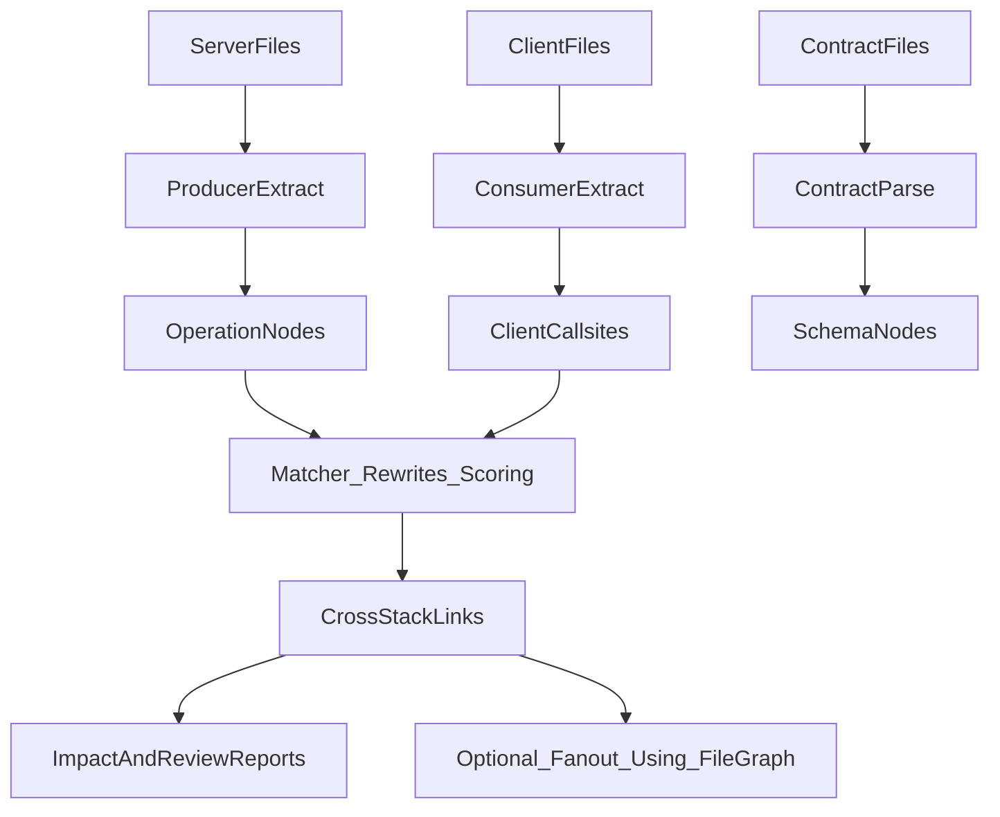

# Cross-stack API Linking (Server ↔ Client) Plan

## Goal

Enable a code review/impact agent to trace an API change from server code to impacted client callsites across many languages/frameworks in a monorepo, without requiring an expensive specialized LLM.

Key outcome: when server routes or schemas change, the tool can report likely impacted client files/calls with **confidence + evidence**, and optionally fan out via the existing file dependency graph.

## Constraints & Design Principles

- **Framework-agnostic first**: rely on structural heuristics (strings/templates, request objects, route patterns) rather than library names.
- **No LLM required**: everything should run via Tree-sitter + cheap parsing + small constant folding.
- **Explainable output**: every cross-stack link must include “why” (matched path/method, rewrite used, contract match).
- **Low false-positive bias**: use scoped search (roots/globs) + confidence scoring + thresholds.
- **Incrementally adoptable**: useful with just REST string matching; improved with contract artifacts (OpenAPI/GraphQL/proto) and richer extractors.

## Proposed Architecture

Introduce a separate, language-agnostic layer: a **Contract Index / Contract Graph**.

- **Operation node**: stable ID representing an API callable surface.
  - REST: `METHOD:/normalized/path/:params`
  - GraphQL: `graphql:<operationName>` (or hash of document if unnamed)
  - gRPC: `grpc:<package>.<Service>/<Method>`
- **Schema node** (optional but high value): OpenAPI component, GraphQL type, proto message, etc.

The existing file graph remains unchanged; cross-stack linking is an additional index/report.

### Data flow

## Configuration Proposal (User-authored)

Add an optional section (file location TBD; most likely `codegraph.json` or a new config file) to define **where server APIs live** and **where client calls live**, plus rewrite rules.

### Minimal configuration

- **servers**: roots/globs to search for producers
- **clients**: roots/globs to search for consumers
- **rewrites**: (clientPrefix → serverPrefix) mapping per client↔server pair
- **matching**: thresholds and normalization options

Example shape:

- `apiLinking.servers[].roots` and `.include`
- `apiLinking.clients[].roots` and `.include`
- `apiLinking.rewrites[]` with `fromPrefix`/`toPrefix`
- `apiLinking.matching.minConfidence`

### Optional high-confidence inputs

- `contracts.openapi` globs
- `contracts.graphqlSchema` globs
- `contracts.proto` globs

## Extraction Strategy (No LLM)

### Producer extraction (server)

Tiers:

- **Tier A (best)**: parse contracts (OpenAPI/GraphQL/proto) → operations/schemas.
- **Tier B**: AST-based route detection per language family (call expressions / annotations / attribute routing).
- **Tier C**: fallback regex/string heuristics for route-looking strings.

Producer output fields:

- operationId, handler location (file+range or symbol handle), method/path evidence, confidence.

### Consumer extraction (client)

Framework/library-agnostic patterns:

- URL/path-like **string literals** and **templates** in call expressions
- request-like **object literals** with keys `url/uri/path/endpoint/route` and optionally `method`
- cheap **intra-file constant folding** for strings (identifiers bound to string literals; concat and template segments)

Consumer output fields:

- candidate (method?, pathPattern), callsite location, evidence, confidence.

## Matching / Joining

Implement a scoring matcher:

- normalize paths (slashes, query stripping, param placeholders)
- apply rewrite rules (client prefix → server prefix)
- score by method match, path match quality, evidence quality
- keep top-N matches per callsite; label ambiguous matches; filter by minConfidence.

## Integration Points in This Repo

Likely additions/changes:

- Add new index/report module(s) under `src/` (e.g. `src/xstack/` or `src/contracts/`).
- Extend CLI (`src/cli.ts`) with a command like `xstack` / `api-link` that outputs JSON report (and optionally Mermaid).
- Extend review/impact flows (`src/review.ts`, `src/impact/*`) to optionally include cross-stack impacted client callsites.
- Reuse language infrastructure:
  - Language supports and compiled queries (`src/languages.ts`)
  - File listing and workspace info (`src/util.ts`)
  - Existing dependency graph for fan-out (`src/graphs.ts`, `src/types.ts`)

## Output / UX

Define an “explainable” report structure:

- operations: list of operation nodes
- producers: server handler links
- consumers: client callsites
- links: matched edges with `confidence` + `evidence` + `rewriteUsed`
- impactedClients: grouped by confidence

## Validation & Testing

Add tests that don’t depend on specific frameworks:

- REST: server path `/api/users/:id` matched to client `fetch('/api/users/123')`
- rewrite: client `/api/*` matched to server `/v1/*`
- ambiguity: two servers exposing same route; ensure both links produced with ranks
- constant folding: `const API='/api'; fetch(API + '/users')`
- contract-first: OpenAPI operations matched without code heuristics (if test fixtures included)

## Phased Delivery

- **Phase 0**: finalize config shape and report schema.
- **Phase 1**: REST-only, heuristic consumer extraction + producer extraction via route-looking strings in server roots.
- **Phase 2**: add constant folding + request-object parsing; add rewrite support.
- **Phase 3**: contract parsing (OpenAPI/GraphQL/proto) and schema-driven impact.
- **Phase 4**: framework-specific producer pattern packs (optional) to reduce false positives.

## Key Decisions to Make Later

- Config file location: reuse `codegraph.json` vs a new config file.
- Report format: JSON-only vs include Mermaid/DOT output.
- Whether to evolve `EdgeTo` in `src/types.ts` or keep cross-stack as a separate report/index.
- Confidence defaults and how aggressively to filter ambiguous links.