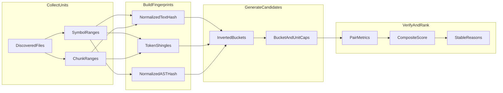

# Duplicate Detection Approaches and Scoring Plan

## Goal

Create **[docs/superpowers/plans/2026-05-19-duplicate-detection.md](docs/superpowers/plans/2026-05-19-duplicate-detection.md)** as a design document for likely duplicate-code detection in Codegraph.

The plan should compare several approaches, explain which ones can be combined, and define a scoring model that ranks duplicate-refactor candidates with stable reasons. It should stay design-only: no public README claims, CLI contracts, or skill updates until implementation ships.

---

## Recommendation

Use a **structural-first, embedding-adjacent** design:

- **V1 core:** deterministic region hashing, normalized tokens, winnowed token shingles, and symbol/chunk metadata.
- **V1 optional where cheap:** normalized AST fingerprints for languages with reliable parse trees.
- **Not V1 core:** model embeddings, semantic-equivalence claims, or persistent SQLite schema changes.
- **External path:** continue to support semantic/vector workflows through `codegraph chunk` output rather than storing embeddings in Codegraph.

This fits the existing architecture: Codegraph already centers on fast structural answers, vectorless agent search, Tree-sitter parsing, `ProjectIndex`, and semantic chunks.

---

## Source Anchors

The design document should explicitly link to these existing surfaces:

- [docs/superpowers/plans/2026-05-14-agent-search-artifact-mcp.md](docs/superpowers/plans/2026-05-14-agent-search-artifact-mcp.md): establishes that agent search/explain are deterministic and avoid embeddings in the core path.
- [docs/agent-workflows.md](docs/agent-workflows.md): documents vectorless search/explain behavior and bounded agent packets.
- [docs/library-api.md](docs/library-api.md): documents chunking for LLM/vector workflows.
- [docs/how-it-works.md](docs/how-it-works.md): documents content-hash caching, Tree-sitter, `ProjectIndex`, and read-performance constraints.
- [src/chunking/chunkFile.ts](src/chunking/chunkFile.ts): source-level semantic chunk boundaries and `Chunk` metadata.
- [src/chunking/chunkSFC.ts](src/chunking/chunkSFC.ts): Vue/Svelte/Astro-style block chunking.
- [src/indexer/types.ts](src/indexer/types.ts): `ProjectIndex`, `ModuleIndex`, and `SymbolDef` (`kind`, `range`, `lineSpan`, `complexity`, `docstring`).
- [src/agent/search.ts](src/agent/search.ts): deterministic ranking style (`score`, reasons, limits, stable sort).
- [src/graphs/grep.ts](src/graphs/grep.ts): AST/text grep capabilities.
- [src/impact/parse.ts](src/impact/parse.ts) and [src/impact/types.ts](src/impact/types.ts): git `similarityIndex` handling for rename/copy metadata.

---

## Problem Statement

### In Scope

- Surface likely duplicate or near-duplicate code regions for human/agent review.
- Prioritize refactor candidates where duplication creates maintenance risk.
- Provide explainable `reasons` so users can judge suggestions quickly.
- Keep runtime bounded on large repositories.
- Reuse existing discovery, chunking, symbol, graph, and impact infrastructure.

### Out of Scope

- Proving semantic equivalence.
- Cross-language clone detection in V1.
- Embedding-backed storage or model execution inside Codegraph core.
- Replacing `grep`, `search`, `refs`, or IDE clone-detection UX.
- Any persistent SQLite schema change in the first implementation.

---

## Duplication Taxonomy

| Clone type | Description | V1 support | Primary signals |
|------------|-------------|------------|-----------------|
| Type-1 | Exact duplicated text | Yes | Raw/normalized hash |
| Type-2 | Same structure with renamed identifiers/literals | Yes | Normalized AST hash, normalized token shingles |
| Type-3 | Edited copy with inserted/deleted statements | Partial | Winnowing, MinHash/Jaccard, LCS ratio |
| Type-4 | Semantically equivalent but structurally different | External only | Embeddings or deeper semantic analysis |

The plan should be explicit that Type-4 is a discovery aid when powered externally, not a correctness claim.

---

## Approach Catalog

The markdown plan should describe each approach with inputs, Codegraph hooks, cost, strengths, weaknesses, and best clone types.

### 1. Exact Region Hash

- **What:** Hash normalized source text for a symbol/chunk region.
- **Inputs:** source text, unit byte/line range.
- **Hooks:** `ProjectIndex` symbols, `chunkFile`, cache hash behavior documented in `docs/how-it-works.md`.
- **Cost:** O(bytes), deterministic, no persistent schema needed.
- **Best for:** Type-1.
- **Weakness:** misses identifier renames and small edits.

### 2. Comment/Whitespace-Normalized Hash

- **What:** Drop comments and normalize whitespace before hashing.
- **Inputs:** source text plus optional language comment rules.
- **Hooks:** language definitions and Tree-sitter comments when available.
- **Cost:** O(bytes), deterministic.
- **Best for:** Type-1 with formatting drift.
- **Weakness:** comment stripping must avoid corrupting string literals; prefer parser-backed stripping when available.

### 3. Symbol Metadata Prefilter

- **What:** Use symbol kind, line span, complexity, exported/local status, and docstring presence to prioritize candidate comparisons.
- **Inputs:** `SymbolDef`, `ModuleIndex`, export metadata.
- **Hooks:** `src/indexer/types.ts`, `src/indexer/locals-and-exports.ts`.
- **Cost:** O(symbols), deterministic.
- **Best for:** reducing comparisons before precise similarity.
- **Weakness:** metadata is not proof of duplication and should never be sufficient alone.

### 4. Chunk-Body Similarity

- **What:** Compare semantically bounded chunks using token overlap and token-count similarity.
- **Inputs:** `Chunk` objects from `chunkFile`, `chunkTextFile`, and `chunkSFCFile`.
- **Hooks:** `src/chunking/chunkFile.ts`, `src/chunking/chunkTextFile.ts`, `src/chunking/chunkSFC.ts`.
- **Cost:** O(chunks + candidate pairs), deterministic.
- **Best for:** languages or file types where symbol extraction is weak.
- **Weakness:** chunks can be larger than functions, so scoring must penalize broad boilerplate.

### 5. Token N-Gram Fingerprints

- **What:** Normalize tokens, build k-token shingles, and bucket units by shared shingle hashes.
- **Inputs:** source text or parser tokens.
- **Hooks:** language definitions, chunk boundaries, symbol ranges.
- **Cost:** O(tokens); memory proportional to unique shingles.
- **Best for:** Type-2 and lightweight Type-3 candidate generation.
- **Weakness:** common boilerplate can create noisy buckets; bucket sizes need caps.

### 6. Winnowing / MinHash

- **What:** Keep representative fingerprints from token shingles to estimate similarity without all-pairs comparison.
- **Inputs:** normalized token shingles.
- **Hooks:** duplicate fingerprint index module added in a future implementation.
- **Cost:** O(tokens) indexing plus O(candidates) verification.
- **Best for:** scalable Type-3 near-copy detection.
- **Weakness:** requires tuning window size, shingle size, and banding thresholds.

### 7. Normalized AST Fingerprint

- **What:** Serialize normalized node structure while replacing identifiers and literals with placeholders.
- **Inputs:** Tree-sitter parse tree, unit range.
- **Hooks:** native Tree-sitter path, JS fallback where supported.
- **Cost:** parser-dependent; deterministic; good fit for languages with stable grammars.
- **Best for:** Type-2.
- **Weakness:** cross-language parity is harder; AST normalization rules must be explicit per language.

### 8. AST Structural Grep Recurrence

- **What:** Reuse AST grep to find repeated structural patterns users care about.
- **Inputs:** Tree-sitter query or text pattern.
- **Hooks:** `src/graphs/grep.ts`.
- **Cost:** O(files) per query.
- **Best for:** targeted repeated anti-patterns, not general clone detection.
- **Weakness:** requires known query shape.

### 9. Git Similarity Metadata

- **What:** Use git diff `similarity index` from rename/copy detection to flag changed-file duplication context.
- **Inputs:** git/raw diff.
- **Hooks:** `src/impact/parse.ts`, `src/impact/types.ts`.
- **Cost:** free when impact parsing already runs.
- **Best for:** PR-scoped copy/rename signals.
- **Weakness:** not whole-repo; depends on git diff metadata.

### 10. External Embeddings

- **What:** Use `codegraph chunk` output with a user-managed embedding model/vector store.
- **Inputs:** chunk text and metadata.
- **Hooks:** `codegraph chunk`, `chunkFile`, `chunkTextFile`.
- **Cost:** external model/runtime/storage; non-deterministic across providers/models.
- **Best for:** Type-4 discovery and natural-language similarity.
- **Weakness:** not suitable as core duplicate proof; should be documented as adjacent.

---

## Recommended Pipeline



### Stage 1: Collect Comparable Units

Default to a hybrid unit strategy:

- Prefer symbol ranges for functions, methods, classes, interfaces, types, SQL routines, and SQL objects.
- Fall back to semantic chunks for files where symbol coverage is incomplete.
- Preserve both identifiers when a unit has both a symbol and chunk boundary.
- Skip units below `minTokens` (default: 40 for duplicate detection, not the chunking default of 150) unless exact hash matches are requested.
- Skip or split units above `maxTokens` (default: 800) to avoid whole-file false positives.

Suggested unit type:

```ts
type DuplicateUnit = {
  id: string;
  file: string;
  languageId: string;
  kind: "symbol" | "chunk" | "sql" | "text";
  name?: string;
  symbolKind?: string;
  startLine: number;
  endLine: number;
  tokenCount: number;
  complexity?: number;
};
```

### Stage 2: Build Fingerprints

Generate cheap fingerprints first:

- `rawHash`: exact source region hash.
- `normalizedTextHash`: comment/whitespace-normalized hash.
- `tokenShingles`: normalized token k-grams, default `k = 5`.
- `winnowedSignature`: representative shingle hashes, default window size `4`.
- `astShapeHash`: optional normalized AST structure hash where parse data is available.

### Stage 3: Generate Candidates

Avoid all-pairs comparison:

- Bucket by `normalizedTextHash`, `astShapeHash`, and winnowed shingle hashes.
- Cap buckets larger than `maxBucketSize` (default: 200) or down-weight them as boilerplate.
- Only compare pairs that share enough evidence:
  - exact normalized hash match, or
  - AST shape hash match, or
  - at least `minSharedShingles` (default: 3), or
  - PR-scoped git `similarityIndex` signal.
- Preserve deterministic pair identity as sorted `(leftUnitId, rightUnitId)`.

### Stage 4: Verify Pair Metrics

For each candidate pair, compute bounded metrics:

- `tokenJaccard`
- `orderedTokenSimilarity` (optional LCS ratio; only for small enough units)
- `shingleOverlap`
- `lengthRatio`
- `sameSymbolKind`
- `lineSpanRatio`
- `astShapeEqual`
- `sameFile`
- `sharedDependencyContext` (weak hint from graph adjacency)

### Stage 5: Rank and Report

Emit bounded, deterministic suggestions with `score`, `confidence`, `cloneType`, metrics, and stable reasons.

```ts
type DuplicateUnitRef = {
  file: string;
  startLine: number;
  endLine: number;
  languageId: string;
  kind: "symbol" | "chunk" | "sql" | "text";
  name?: string;
  symbolKind?: string;
};

type DuplicateSuggestion = {
  score: number;
  confidence: "high" | "medium" | "low";
  cloneType: "exact" | "renamed" | "near" | "weak";
  left: DuplicateUnitRef;
  right: DuplicateUnitRef;
  metrics: {
    tokenJaccard?: number;
    shingleOverlap?: number;
    lengthRatio?: number;
    lineSpanRatio?: number;
    complexityDelta?: number;
    similarityIndex?: number;
  };
  reasons: string[];
};
```

---

## Scoring System

Use a transparent score capped to `0..100`. Signals should be explainable and stable; no score should depend on nondeterministic model output in the core path.

### Positive Signals

| Signal | Weight | Reason example | Notes |
|--------|--------|----------------|-------|
| Raw source hash match | +60 | `raw_hash_match` | Exact duplicate, strongest signal |
| Normalized text hash match | +50 | `normalized_text_hash_match` | Formatting/comment-insensitive Type-1 |
| AST shape hash match | +40 | `ast_shape_match` | Strong Type-2 signal |
| Token Jaccard >= 0.95 | +30 | `token_jaccard_0.97` | Strong near-exact signal |
| Token Jaccard >= 0.85 | +22 | `token_jaccard_0.88` | Good Type-2/Type-3 signal |
| Token Jaccard >= 0.70 | +12 | `token_jaccard_0.73` | Weak alone |
| Shingle overlap | +0 to +25 | `shared_shingles_14` | Scale linearly, cap at +25 |
| Ordered token similarity >= 0.80 | +10 | `ordered_similarity_0.84` | Optional expensive metric |
| Same symbol kind | +4 | `same_symbol_kind_function` | Small boost |
| Line span within 15% | +4 | `similar_line_span` | Small boost |
| Complexity within 20% | +3 | `similar_complexity` | Small boost |
| PR git similarity >= 80% | +20 | `git_similarity_92` | Only in impact/review mode |
| Shared dependency context | +3 | `shared_dependency_context` | Weak context hint |

### Negative Signals

| Signal | Weight | Reason example | Notes |
|--------|--------|----------------|-------|
| Token count below threshold | -25 | `trivial_body_penalty` | Avoid getters, tiny helpers |
| Length ratio outside 0.5..2.0 | -20 | `length_mismatch_penalty` | Avoid broad false positives |
| Boilerplate bucket too large | -20 | `boilerplate_bucket_penalty` | Common generated patterns |
| License/header-only region | -30 | `license_header_penalty` | Likely not actionable |
| Generated or vendored path | -15 | `generated_path_penalty` | Configurable; hard filter if ignored |
| Same file and adjacent regions | -10 | `same_file_adjacent_penalty` | Often internal repetition; still optional |

### Hard Filters

Discard pairs regardless of score when:

- Either file is excluded by discovery config or CLI ignore globs.
- Ranges overlap in the same file.
- One unit fully contains the other and both represent the same enclosing symbol.
- Both units are below `minTokens`, unless raw hashes match and `--include-small` is set.
- Bucket size exceeds `maxBucketSize` and no exact/AST hash signal exists.

### Confidence Tiers

- **High:** `score >= 80`, or raw/normalized hash match with `tokenJaccard >= 0.90`, or AST shape match with `tokenJaccard >= 0.85`.
- **Medium:** `score >= 55` and `tokenJaccard >= 0.70`.
- **Low:** `score >= 35`; show only when requested or in verbose JSON.

### Clone Type Classification

- **exact:** raw or normalized text hash match.
- **renamed:** AST shape match or very high token similarity with different identifiers/literals.
- **near:** strong shingle/token similarity with edits.
- **weak:** score passes low threshold but lacks a strong structural proof.

### Sort Order

Sort deterministically:

1. `confidence` rank (`high`, `medium`, `low`)
2. `score` descending
3. `tokenJaccard` descending
4. `left.file`, `left.startLine`, `right.file`, `right.startLine`

---

## Output and UX Options

Document these as future implementation choices, not commitments.

### CLI

Preferred first surface:

```bash
codegraph duplicates ./src --min-confidence medium --json
codegraph duplicates ./src --cross-file-only --limit 50
codegraph duplicates --provider git --base main --head HEAD
```

### Library

```ts
const index = await buildProjectIndex(root);
const result = await findDuplicates(index, {
  minConfidence: "medium",
  crossFileOnly: true,
  limit: 50,
});
```

### Agent and MCP

Add only after CLI/library behavior is stable:

- `search` could surface duplicate handles for queries like `duplicate validation logic`.
- `explain` could include `duplicateCandidates` for a file/symbol.
- MCP could expose `duplicates` as a bounded, read-only tool.

---

## Rollout Phases

### Phase 0: Design Doc Only

- Add the markdown plan.
- No public docs, CLI help, skill, or API changes.

### Phase 1: In-Memory Engine

- Create internal duplicate unit extraction and fingerprinting helpers.
- Implement exact hash, normalized text hash, token shingles, and winnowing.
- Add focused tests with inline fixtures.
- No cache or SQLite persistence.

### Phase 2: CLI and Library Surface

- Add `findDuplicates(index, options)` and `codegraph duplicates`.
- Return deterministic JSON with bounded results and omission counts.
- Add CLI regression tests.
- Update `docs/cli.md`, `docs/library-api.md`, and `codegraph-skill/codegraph/SKILL.md`.

### Phase 3: AST Normalization

- Add language-aware AST shape hashing for supported source languages.
- Update `docs/language-parity.md` and `docs/scenario-catalog.md`.
- Add per-language tests in `tests/languages/*.test.ts`.

### Phase 4: PR-Scoped and Agent Integration

- Use git `similarityIndex` and changed-symbol context in impact/review mode.
- Add duplicate candidates to `explain` packets or MCP only after output shape stabilizes.

### Phase 5: Optional Persistence

- Consider `.codegraph-cache/duplicates-v1` only if repeated runs need it.
- Avoid SQLite schema changes unless there is a clear query use case; if added, include migration tests per `AGENTS.md`.

---

## Language and Parity Rules

- V1 supports same-language comparisons only.
- Source languages should use symbol-first units where possible.
- SQL may start with statement/object chunks and SQL symbols where available.
- Vue/Svelte/Astro should compare script/style/template blocks separately through SFC chunking.
- Graph-first formats and config files may be chunk-only.
- If a language lacks AST normalization, token/chunk detection should still work and the limitation must be documented.

---

## Testing Strategy

When implemented, test real behavior rather than tuning just to pass thresholds.

Core fixtures:

- Exact duplicate functions in two files.
- Same function with renamed variables and literals.
- Near-copy function with one edited branch.
- Same file non-overlapping duplicate blocks.
- Negative: similar names with different bodies.
- Negative: tiny trivial helpers below threshold.
- Negative: generated/header boilerplate.
- Determinism: same repo produces the same ordered suggestions.
- Bounds: large repeated boilerplate bucket does not explode comparisons.
- PR mode: git `similarityIndex` boosts changed-file suggestions without requiring whole-repo scan.

Likely test locations:

- `tests/duplicates.test.ts` for engine behavior.
- `tests/cli-regressions.test.ts` for CLI output.
- `tests/languages/*.test.ts` for AST normalization parity when added.
- `tests/impact.test.ts` or `tests/impact-streaming.test.ts` for PR-scoped duplicate context.

---

## Open Questions

---

- Should `minTokens` default to 40 for duplicate detection, or stay closer to chunking's 150-token default?
- Should same-file duplicates be enabled by default, or should the default focus on cross-file refactor candidates?
- Should high-fan-in/hotspot files increase score because refactors are valuable, or decrease score because utility patterns are noisy?
- Should PR-scoped mode compare changed regions against the whole repo, or only changed files against touched dependency neighborhoods?
- Should embedding integration remain only a documented external workflow, or should a future plugin interface accept externally computed similarity scores?

---

## Non-Goals for the Markdown Plan

- Do not implement `duplicates` command or library API.
- Do not change SQLite schema.
- Do not add embedding dependencies or package installs.
- Do not update public capability docs until the feature exists.
- Do not claim language parity before tests prove it.

---

## Acceptance criteria

- [ ] New file `docs/superpowers/plans/2026-05-19-duplicate-detection.md` exists.
- [ ] Document includes recommendation, problem statement, source anchors, taxonomy, approach catalog, pipeline, scoring, rollout phases, parity rules, tests, and open questions.
- [ ] At least 10 approaches are documented with cost/strength tradeoffs.
- [ ] Combined pipeline and mermaid diagram are included.
- [ ] Scoring includes positive signals, negative signals, hard filters, confidence tiers, clone type classification, stable sort order, and example reasons.
- [ ] Plan links directly to `chunkFile`, `ProjectIndex`/`SymbolDef`, agent search scoring, AST grep, and impact `similarityIndex`.
- [ ] Plan clearly separates in-core structural detection from external embedding workflows.
- [ ] Plan does not require package installs, SQLite schema changes, or public documentation updates before implementation.
