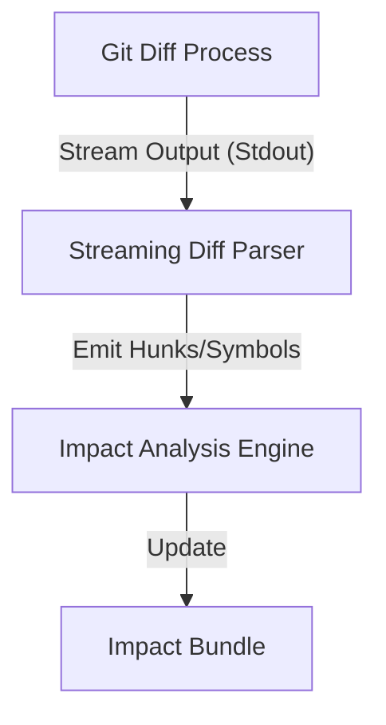

# Plan: Fix Codegraph Large Diff Handling

The current implementation of `analyzeImpactFromDiff` in the `@lzehrung/codegraph` library (used in [`agent/src/adapters/codegraph.ts`](agent/src/adapters/codegraph.ts)) fails on large PRs because it uses `spawnSync` with a default 1MB buffer. This plan outlines the necessary changes to the external library to support larger diffs.

## Proposed Changes (in @lzehrung/codegraph)

### 1. Increase Max Buffer (Immediate Fix)

Update the `git diff` execution to use a significantly larger buffer (e.g., 100MB) to prevent immediate crashes.

```typescript
// Inside GitDiffProvider or equivalent in codegraph repo
const result = spawnSync('git', ['diff', base, head], {
  maxBuffer: 100 * 1024 * 1024, // 100MB
  cwd
});
```

### 2. Transition to Asynchronous Streaming (Long-term Fix)

Refactor the impact analysis engine to use `child_process.spawn` and process the diff stream line-by-line instead of loading the entire string into memory.



### 3. Implement Large Diff Circuit Breaker

Add a pre-check using `git diff --stat` to detect extremely large diffs that might cause OOM or excessive processing time.

- If total insertions/deletions exceed a threshold (e.g., 50k lines), return a partial impact report with a warning.
- Optionally skip binary files or large generated files (e.g., `package-lock.json`) in the diff command to reduce volume.

## Implementation Steps

- Locate the Git provider implementation in the `codegraph` repository.
- Apply the `maxBuffer` increase as a fast follow.
- Develop the streaming parser for the next major version of the library.