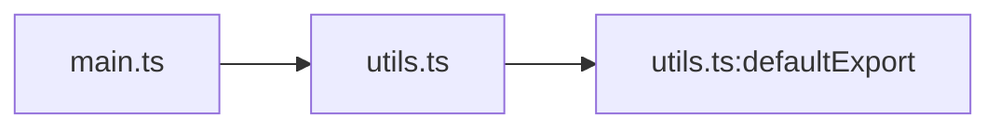

# codegraph

Codegraph is a small multi-language code analysis library and CLI for understanding repos quickly. It builds dependency graphs, symbol indexes, go-to-definition results, find-references results, semantic chunks, architecture drift reports, and PR review and impact artifacts across source languages plus graph-first document, stylesheet, and template formats.

It is built for agent and human workflows that need repo structure fast without standing up a full editor or LSP stack.

## Table of contents

- [Why Codegraph](#why-codegraph)
- [Features](#features)
- [Quick start](#quick-start)
- [CLI examples](#cli-examples)
- [Key output examples](#key-output-examples)
- [Agent setup](#agent-setup)
- [Using as a library](#using-as-a-library)
- [Common workflows](#common-workflows)
- [Supported languages](#supported-languages)
- [Documentation](#documentation)
- [Installation options](#installation-options)
- [FAQ](#faq)
- [Contributing and releases](#contributing-and-releases)

## Why Codegraph

Use Codegraph when you need fast structural answers about a repo without relying on a full editor session or language-server setup.

- Triage an unfamiliar codebase with one pass that highlights hotspots, unresolved imports, cycles, and next commands to run.
- Review diffs with changed symbols, graph deltas, likely regression tests, and risk signals that agents or humans can consume directly.
- Export graph data as JSON, Mermaid, DOT, or SQLite, then inspect it from scripts, Markdown renderers, Graphviz, or SQL tools.
- Keep one workflow across source languages, monorepos, and graph-first document and template formats instead of stitching together separate tools.

For unfamiliar repos with a concrete question, start with `explore "how does auth reach db?" --root . --pretty`; use `orient --root . --budget small --pretty` when you need a map before asking a question.
For daily change work, start with `review --base HEAD --head WORKTREE --summary`; use `impact --base HEAD --head WORKTREE --pretty` as the broader blast-radius map when needed.
Search is code-first by default in hybrid mode, and explore, search, explain, and review packets include analysis labels so reduced-mode or mixed-semantics runs stay visible.
Detailed command contracts and JSON shapes live in [docs/cli.md](./docs/cli.md).

## Features

- Multi-language dependency graphs, including imports, re-exports, `require()`, dynamic imports, workspace resolution, document links, stylesheet imports, and SFC script dependencies.
- Per-file symbol indexes with locals, exports, docstrings, line spans, and lightweight complexity metadata.
- Cross-file go-to-definition and find-references support across the shared source-language pipeline.
- Deterministic agent exploration, orientation, packet retrieval, search, bounded explanations, portable artifact bundles, and MCP tools across files, symbols, chunks, SQL objects, graph neighborhoods, and review ranges with stable follow-up targets.
- Semantic chunking for code and text files, including Vue and Svelte single-file component block splitting.
- Duplicate and near-duplicate detection over indexed symbols, semantic chunks, text chunks, token fingerprints, and AST shape hashes when parser context is available.
- AST grep, public API summaries, unresolved import reports, hotspot analysis, cycle detection, and shortest dependency paths.
- PR impact analysis and review bundles that map diffs to changed symbols, impacted code, likely tests, graph deltas, and conservative provider-backed call-arity hints after signature changes.
- SQL language support for `.sql` files, including statement chunks, object symbols, SQL-to-SQL graph edges, SQL navigation, and statement facts.
- SQLite export plus read-only SQL access for downstream tools and agent workflows.
- Native Tree-sitter parsing by default when a matching prebuilt is available, with reduced graph-only and regex recovery when native is unavailable.

Sample graph output can be generated with `npm run graph:mermaid`, `npm run graph:dot`, or `npm run graph:json`.

This repo keeps test fixtures out of default Codegraph scans with `codegraph.config.json`:

```json
{
  "discovery": {
    "ignoreGlobs": ["tests/samples/**", "tests/languages/samples/**"]
  }
}
```

Use this pattern in other repos when large fixture, generated, or vendored trees should not participate in search, unresolved-import checks, graphing, indexing, inspect, impact, or review runs. Config globs are project-root-relative. CLI `--include-glob` and `--ignore-glob` stay relative to each active scan root.

## Quick start

Requirements: Node.js 24.10+.

For contributors and first-time evaluation, start from a local source checkout:

```bash
git clone https://github.com/lzehrung/codegraph.git
cd codegraph
npm install
npm run build
```

`npm run build` always rebuilds `dist/`. If Cargo is available, it also requires the local native workspace build to succeed; if Cargo is unavailable, it still completes with the JavaScript build output and a warning.

Then start with the default workflow. For code reviews, the lowest-friction loop is `review --summary` first, `impact --pretty` only when you need blast radius, then `search` or `explain` on a file or symbol named in the summary; use review JSON when a follow-up needs stable handles.

```bash
# compact reviewer handoff for current edits
node ./dist/cli.js review --base HEAD --head WORKTREE --summary

# broader blast-radius map when the review packet needs expansion
node ./dist/cli.js impact --base HEAD --head WORKTREE --pretty

# one-call answer for a concrete repo question
node ./dist/cli.js explore "how does auth reach db?" --root . --pretty

# bounded repo orientation with next-step suggestions
node ./dist/cli.js orient --root . --budget small --pretty

# find and explain a concrete anchor
node ./dist/cli.js search "build review report" --json
node ./dist/cli.js explain src/cli.ts

# optional runtime and artifact health check
node ./dist/cli.js doctor

# optional broader architecture summary
node ./dist/cli.js inspect ./src --limit 20

# build a graph for product code
node ./dist/cli.js graph --root . ./src --compact-json --output codegraph.json

# inspect public API surface
node ./dist/cli.js apisurface

# find duplicate and near-duplicate code
node ./dist/cli.js duplicates ./src --min-confidence medium --limit 20

# compare architecture drift between refs
node ./dist/cli.js drift ./src --base origin/main --head HEAD --compact-json
node ./dist/cli.js drift ./src --base origin/main --head HEAD --pretty --graph-edges summary --public-api removals
```

If you install the published CLI instead of using a source checkout, replace `node ./dist/cli.js` with `codegraph`.

Small orientation packets skip deeper health analysis and record that omission; use `--budget medium` or `--budget large` when health counts matter.

## CLI examples

Choose output by consumer:

- Use `--pretty` or `--summary` when a person or model needs a compact triage view.
- Use `--json` or library APIs when a script, tool wrapper, or follow-up command needs stable fields.

Use these as starting points, then see [docs/cli.md](./docs/cli.md) for all flags, defaults, and output contracts.

```bash
# fastest code-review handoff for current edits
codegraph review --base HEAD --head WORKTREE --summary
codegraph impact --base HEAD --head WORKTREE --pretty

# repo question, orientation, and bounded follow-up
codegraph explore "how does auth reach db?" --root . --pretty
codegraph orient --root . --budget small --pretty
codegraph search "build review report" --json
codegraph explain src/review.ts

# semantic navigation
codegraph goto <file> <line> <column>
codegraph refs --file src/index.ts --line 12 --col 17 --pretty

# architecture and review
codegraph drift ./src --base origin/main --head HEAD --pretty --graph-edges summary --public-api removals
codegraph drift ./src --base origin/main --head HEAD --compact-json
codegraph impact --base origin/main --head HEAD --pretty
codegraph review --base origin/main --head HEAD --summary

# duplicate and graph exploration
codegraph duplicates ./src --json --min-confidence medium --limit 20
codegraph graph --root . ./src --compact-json --output codegraph.json
```

See [docs/cli.md](./docs/cli.md) for full flags, JSON shapes, drift policy gates, duplicate scopes, and review output details.

## Key output examples

These excerpts show the shape of the outputs agents and humans usually consume. Use `--pretty` or `--summary` for triage, and switch to JSON when a follow-up command needs stable handles, paths, ranges, reasons, or counts.

### Orientation

`orient --root . --budget small --pretty` gives first-turn focus targets plus copyable follow-ups:

```text
Summary
- 567 file(s) in scope.
- 5 graph-central module(s) ranked for first follow-up.
- Health analysis skipped for small budget.

Start here
- src/index.ts: graph-central module: fan-in 96, fan-out 40, score 232
  - codegraph packet get src/index.ts --pretty
  - codegraph explain src/index.ts

Recommended next
- codegraph hotspots . --limit 20
- codegraph impact --base HEAD --head WORKTREE --pretty
- codegraph review --base HEAD --head WORKTREE --summary
- codegraph search <query> --json
```

### Search

`search "graph json" --json` returns ranked, explainable anchors. Follow-up commands reuse the returned handle, file, or symbol path:

```json
{
  "schemaVersion": 1,
  "query": "build review report",
  "mode": "hybrid",
  "analysis": {
    "label": "native semantic"
  },
  "resultCount": 1,
  "totalCandidates": 42,
  "results": [
    {
      "handle": "symbol:src%2Freview.ts:buildReviewReport:214:1",
      "kind": "symbol",
      "label": "buildReviewReport",
      "file": "src/review.ts",
      "score": 248,
      "provenance": {
        "surface": "code",
        "capability": "semantic",
        "analysisMode": "semantic",
        "backend": "native",
        "confidence": "high"
      },
      "rankReasons": ["exact phrase match in symbol name", "symbol token match: build, review, report"],
      "followUps": [
        "codegraph explain \"symbol:src%2Freview.ts:buildReviewReport:214:1\"",
        "codegraph refs --file src/review.ts --line 214 --col 1 --pretty"
      ]
    }
  ]
}
```

### Impact

`impact --base HEAD --head WORKTREE --pretty` answers what changed and what else can break. Pretty output keeps severity and reason labels visible:

```text
Impact Analysis Report
======================
Changed files: 1
Changed symbols: 1
Impacted items: 2

utils.ts: defaultExport (reason: direct reference, severity: 100.0%)
main.ts: defaultExport (reason: transitive dependency, severity: 72.0%)
```

Use `--compact-json` when tooling needs normalized arrays, graph edges, diagnostics, and `schemaVersion`:

```json
{
  "schemaVersion": 1,
  "format": "compact",
  "files": ["utils.ts", "main.ts", "dynamic-import.ts", "helpers.ts", "tsconfig.json"],
  "changedFiles": [{ "file": 0, "kind": "modified", "hunks": [{ "start": 28, "end": 38 }] }],
  "changedSymbols": [{ "file": 0, "name": "defaultExport", "kind": "function", "exported": true }],
  "impacted": [
    { "file": 0, "symbols": ["defaultExport"], "reasons": ["directRef"], "severity": 1 },
    { "file": 1, "symbols": ["defaultExport"], "reasons": ["importAlias", "transitive"], "severity": 0.72 }
  ]
}
```

### Review

`review --base HEAD --head WORKTREE --summary` is the compact reviewer handoff. It combines changed files, changed symbols, candidate tests, risk signals, review tasks, duplicate leads, and call-compatibility hints when a supported signature change has resolvable callsites:

```text
Review Summary
==============
Status: ok
Files changed: 5
Symbols changed: 22
Candidate tests: 1 (high: 1, medium: 0, low: 0)
Risk: high (80)
Signals: exported-symbols-changed, many-symbols-changed

Changed files:
- src/invoices-a.ts: updated (label, output, rounded, subtotal, summarizeInvoices)
- src/invoices-b.ts: updated (label, output, rounded, subtotal, summarizeInvoices)
- src/orders-a.ts: updated (label, output, rounded, subtotal, summarizeOrders)
- src/orders-b.ts: updated (label, output, rounded, subtotal, summarizeOrders)
- src/pricing.ts: updated (calculateTotal, discounted)

Candidate tests:
High-confidence tests:
- tests/pricing.test.ts: importsChanged

Review tasks:
- review-summary: medium - Review changed symbols (baseline-review)
- api-compat: high - Verify API compatibility (exported-symbols-changed)
- high-change-volume: high - Assess change scope (large-change-set)
- duplicate-sibling-check:d9a0ad66c9cb5610: high - Check related duplicate implementation (duplicate-sibling)
- duplicate-sibling-check:a9188e0046912ef6: high - Check related duplicate implementation (duplicate-sibling)

Call compatibility:
- calculateTotal: src/checkout.ts:3 passes 2 arguments; new signature requires 3.
- calculateTotal: tests/pricing.test.ts:2 passes 2 arguments; new signature requires 3.

Duplicate leads:
- src/invoices-a.ts:1-10 matches src/invoices-b.ts:1-10 (exact, score 100).
- src/orders-a.ts:1-10 matches src/orders-b.ts:1-10 (exact, score 100).
- src/invoices-a.ts:1-10 matches src/orders-a.ts:1-10 (renamed, score 100).
- omitted: 1 by budget, 24 hidden evidence items
```

### Dependency graph

For a small dependency slice, Mermaid output can be pasted directly into Markdown renderers that support Mermaid:



For full-repo exploration, generate a portable graph artifact for scripts or downstream tools:

```bash
codegraph graph --root . ./src --compact-json --output codegraph.json
codegraph graph --root . ./src --mermaid --output graph.mmd
codegraph graph --root . ./src --dot --output graph.dot
```

## Agent setup

Using a local agent client? The top-level installer configures Codegraph-owned MCP entries, bundled skill payloads, and marker files for supported clients, while preserving existing user config:

```bash
codegraph install --target codex,claude --dry-run
codegraph install --target codex,claude --yes
codegraph install --print-config codex
codegraph uninstall --target codex --yes
```

Supported installer targets are `codex`, `claude`, `cursor`, `gemini`, `opencode`, and `agents`. Writes require `--yes`; `--dry-run` previews files, and `uninstall` removes only Codegraph-owned marker blocks, marker files, exact bundled skill payloads, or exact installer-owned MCP entries.

Using a skill-aware agent only? Install the bundled skill directly so repo navigation, semantic references, dependency tracing, and PR impact questions route to Codegraph automatically:

```bash
# Codex CLI: ${CODEX_HOME:-~/.codex}/skills/codegraph
codegraph skill install --agent codex

# Claude Code: ~/.claude/skills/codegraph
codegraph skill install --agent claude

# Universal agent skills: ~/.agents/skills/codegraph
codegraph skill install --agent agents

# Cursor CLI: ~/.cursor/skills/codegraph
codegraph skill install --agent cursor

# Gemini CLI: ~/.gemini/skills/codegraph
codegraph skill install --agent gemini

# OpenCode: ~/.config/opencode/skills/codegraph
codegraph skill install --agent opencode
```

For a custom skill location, use `codegraph skill install --target <path>/skills/codegraph`; the target must end with `skills/codegraph`, and the installer creates the directory as needed. Cursor CLI supports native skills directories too, so `.cursor/skills/codegraph` works alongside the universal `~/.agents/skills/codegraph` location. To inspect the packaged skill paths and target health, run `codegraph skill doctor`.

## Using as a library

Use the TypeScript API when another program needs deterministic explore responses, file packs, review packets, or model prompts. CLI `--pretty` and `--summary` output is also useful for model-readable triage, but library callers should keep structured fields until the final UI or prompt boundary. For repeated calls, prefer one warm `createCodeReviewSession()` or one agent/MCP session over rebuilding ad hoc indexes.

```ts
import {
  buildProjectIndex,
  buildReviewReport,
  analyzeArchitectureDrift,
  analyzeImpactFromDiff,
  analyzeImpactStreaming,
  tool_impactJSON,
} from "@lzehrung/codegraph";
const root = process.cwd();
const index = await buildProjectIndex(root, { native: "auto" });

const review = await buildReviewReport(root, {
  gitBase: "origin/main",
  gitHead: "HEAD",
  reviewDepth: "standard",
});

const drift = await analyzeArchitectureDrift(root, {
  provider: "git",
  base: "origin/main",
  head: "HEAD",
  failOn: ["new-cycle", "public-api-removal"],
  format: "compact",
  graphEdges: "summary",
  publicApi: "removals",
});

const impact = await analyzeImpactFromDiff(root, index, {
  provider: "git",
  base: "origin/main",
  head: "HEAD",
  detectBreakingChanges: true,
});

for await (const chunk of analyzeImpactStreaming(root, index, {
  provider: "git",
  base: "origin/main",
  head: "HEAD",
})) {
  if (chunk.type === "complete") {
    console.log(chunk.report.changedSymbols, chunk.report.impacted);
  }
}

const wrapped = await tool_impactJSON(root, { provider: "git", base: "HEAD", head: "WORKTREE" }, { index });
```

Good downstream packs preserve structured fields such as symbol handles, ranges, diff snippets, callsites, graph edges, candidate-test confidence, impact reasons, diagnostics, and `schemaVersion`/`format`. Streaming callers that only need incremental chunks can set `streamSummary: "light"` to skip terminal suggestions, export summaries, re-export chains, ranked top impacts, graph metadata, cycles, clusters, and surface-area work. Use [docs/library-api.md](./docs/library-api.md) for the full API reference and [docs/agent-workflows.md](./docs/agent-workflows.md) for session and streaming recipes.

Impact and review JSON may include `callCompatibility` on changed symbols when a provider-backed callable signature changes and resolved callsites have high-confidence argument counts. Treat these as review leads, not compiler-grade type checking; unsupported or ambiguous callsites are omitted from pretty output. Impact changed-file entries also preserve git copy or rename `oldFile` and `similarityIndex` metadata when available.

The supported package import surface includes the compatibility root export, `@lzehrung/codegraph`, plus documented subpath facades such as `@lzehrung/codegraph/agent`, `@lzehrung/codegraph/indexer`, and `@lzehrung/codegraph/impact`. The public API boundary and compatibility-export guidance live in [docs/library-api.md](./docs/library-api.md#public-api-boundary).

## Common workflows

- Repo triage: run `codegraph inspect ./src --limit 20`, then follow with `codegraph hotspots ./src --limit 20` or `codegraph unresolved` to focus the next pass.
- Duplicate cleanup: run `codegraph duplicates ./src --min-confidence medium` for the default pretty triage view, or add `--json` when a downstream tool needs grouped duplicate data.
- Symbol navigation: use `codegraph goto <file> <line> <column>` and `codegraph refs --file <file> --line <line> --col <column> --pretty` when a question is about definitions or semantic usages rather than matching strings.
- PR review: run `codegraph review --base origin/main --head HEAD --summary` for a compact reviewer handoff with actionable candidate tests, add `codegraph impact --base origin/main --head HEAD --pretty` when you need a ranked blast-radius map, or redirect plain `review` output when a downstream tool needs the full JSON bundle.
- Worktree review: run `codegraph review --base HEAD --head WORKTREE --summary` for current staged and unstaged tracked-file changes, then add `codegraph impact --base HEAD --head WORKTREE --pretty` only when the handoff needs wider blast-radius context. Use `--head STAGED` to compare `HEAD` against the current index.
- Graph exploration: run `codegraph graph --root . ./src --compact-json --output codegraph.json` for scripts, `--mermaid` for Markdown renderers, or `--dot` for Graphviz. Bare `codegraph graph` writes `codegraph.json`; add `--stdout` when piping.
- Public API inspection: run `codegraph apisurface` to summarize exported symbols before refactors, reviews, or release checks.

## Supported languages

### Source languages

JavaScript, TypeScript, Python, PHP, Go, Java, C#, Ruby, Rust, Kotlin, Swift, Zig, C, and C++ all participate in the shared source-language indexing and navigation pipeline.

### Graph-first formats

HTML, Astro, Handlebars, Markdown, MDX, reStructuredText, AsciiDoc, CSS, SCSS, and Less participate in graph or chunking workflows with narrower capability claims than the full source-language pipeline. CSS-family graphing covers stylesheet imports; SCSS also resolves Sass partials, including extensionless and explicit `.scss` specifiers.

### SQL

SQL files participate in normal repository indexing. Codegraph discovers every `.sql` file by default, chunks SQL statements, extracts table/view/index/routine symbols, records common DDL/DML and CTE read/write facts, adds SQL-to-SQL object edges, and supports go-to-definition and find-references within SQL files. SQL navigation resolves schema-qualified names plus object-level `alias.column` and `schema.table.column` references to table/view definitions, but it does not claim column-definition resolution. SQL-to-SQL edges are precise for exact object-name matches, heuristic for unambiguous qualified-to-basename fallback matches, and skipped for ambiguous basename guesses. SQL indexing, graphing, and navigation work in native-only installs without the optional JS fallback package. SQL is still intentionally scoped to SQL semantics: Codegraph does not infer a current schema from migrations, fixtures, dumps, or seeds, and it does not globally link arbitrary application-code strings to SQL objects.

### Single-file components

Vue and Svelte script blocks are parsed with the JS and TS pipeline for dependency graphs and chunking, including external `<script src="...">` dependencies. Semantic navigation remains intentionally narrower.

For the full capability matrix, limitations, and fixture coverage, see [docs/language-parity.md](./docs/language-parity.md) and [docs/scenario-catalog.md](./docs/scenario-catalog.md).

## Documentation

- [docs/installation.md](./docs/installation.md): source checkout, scoped registry, release tarball, native runtime modes, and reduced-mode behavior
- [docs/cli.md](./docs/cli.md): command reference, output formats, SQLite schema, review bundles, and graph export usage
- [docs/library-api.md](./docs/library-api.md): agent explore/orientation/packet/search/explain/artifacts, semantic chunking, indexing, graph APIs, read-only SQL, impact examples, and programmatic review output
- [docs/agent-workflows.md](./docs/agent-workflows.md): explore, orientation packets, search anchors, MCP, sessions, streaming, tool wrappers, review bundles, and agent-oriented review recipes
- [docs/mcp.md](./docs/mcp.md): MCP server setup, tool list, safety model, and client configuration examples
- [docs/how-it-works.md](./docs/how-it-works.md): performance, caching, native runtime behavior, architecture, and testing guidance
- [docs/language-parity.md](./docs/language-parity.md): per-language capability matrix
- [docs/scenario-catalog.md](./docs/scenario-catalog.md): scenario and fixture coverage
- [docs/coverage/README.md](./docs/coverage/README.md): committed Markdown coverage summaries
- [docs/adding-language-support.md](./docs/adding-language-support.md): checklist for new language support
- [PUBLISHING.md](./PUBLISHING.md): release and native artifact workflow

## Installation options

The full install details now live in [docs/installation.md](./docs/installation.md). The short version:

### Source checkout

See the [Quick start](#quick-start) section for the recommended first-run path.

For a local global install from the source checkout, run `npm run build` first and then `npm install -g .`.

### Scoped registry install

```bash
npm config set "@lzehrung:registry" "https://npm.pkg.github.com"
npm i -g @lzehrung/codegraph
```

### Release tarball install

```bash
npm i -g https://github.com/lzehrung/codegraph/releases/download/vVERSION/lzehrung-codegraph-VERSION.tgz
```

Replace `VERSION` with the release you want. The root tarball does not bundle the native addon; source-language parsing still needs the scoped native package path via the `@lzehrung` GitHub Packages registry. Without it, Codegraph runs in reduced graph-only and regex recovery mode.

## FAQ

**Can I drop this into a mixed repo?**
Yes. Codegraph walks the tree, ignores usual generated directories, builds one repo-wide graph, and marks unresolved third-party modules as external. It also detects common project files for Node, Python, Rust, Go, Ruby, Java/Kotlin, .NET, PHP, Swift, C/C++, Nx, and Turborepo so inspection and review output can point at likely project boundaries.

**Does it follow re-exports for definition jumps?**
Yes, when the language extractor records the re-export. Covered examples include JS/TS `export * from`, `export { name } from`, namespace re-exports, and Rust re-export modules. Go, Java, and Kotlin use language-specific package export rules rather than JS-style barrels.

**How accurate is find-references?**
It answers: after this name resolves to this definition, where do recorded imports, aliases, local bindings, and common member uses point back to it? It does not run each language's compiler or type checker, so dynamic dispatch, reflection, generated code, and macro-expanded references can be missed.

**Does it support CommonJS destructuring?**
Yes. Both `const { helperFunction } = require("./module")` and aliased destructuring patterns are supported.

**Does it work with monorepos?**
Yes, with two layers. Node workspace package imports resolve through `package.json` workspaces, `pnpm-workspace.yaml`, and `lerna.json`; pnpm exclude globs are honored. Broader monorepo and project metadata such as `nx.json`, `turbo.json`, `go.work`, `Cargo.toml`, `composer.json`, Maven/Gradle files, .NET projects, Swift packages, and C/C++ build files are detected for project discovery, inspection, and review risk signals. For a parent directory that contains separate child git repositories, use `codegraph graph --root ~/work billing-service shared-ui --json` to index the selected children into one graph without indexing their nested `.git` metadata.

## Contributing and releases

The contributor baseline is:

```bash
npm run build
npm run test:ci
```

`npm run test:ci` writes a Vitest JSON timing report and prints a slow-test summary. Tests over 2 seconds are review-required, and tests over 10 seconds should be treated as integration-tier candidates unless they have a documented reason.

Use `npm test` or `npm run test:fast` for the shorter non-integration suite. Use `npm run test:integration` for CLI and native-runtime integration coverage.

Use `npm run test:coverage`, `npm run test:coverage:native`, or `npm run test:coverage:all` to generate local HTML/LCOV coverage and refresh the compact Markdown summaries in `docs/coverage/`. Use `npm run coverage:markdown` to refresh the Markdown files from existing LCOV output.

If you are touching the native workspace directly, also run `npm run build:native` and `npm run test:native`. Benchmark harness coverage lives behind `npm run test:bench`.

Use the root release scripts to cut independent releases for the packages that actually changed:

```bash
npm run release:patch
npm run release:minor
npm run release:major
npm run release:resume

npm run publish:patch
npm run publish:minor
npm run publish:major
npm run publish:resume
```

Use `--package root`, `--package native`, or a full package name when you need to force a specific package.

For GitHub-driven releases, use the manual `release` Actions workflow with `patch`, `minor`, or `major`. It publishes the root and native packages together, pushes their tags, then creates or updates the overall `vX.Y.Z` GitHub Release with the packed root tarball asset. The workflow refuses reruns on an already-tagged release commit because fresh Actions runners cannot reconstruct the local `publish:resume` state.

For the detailed release flow, native artifact staging, and tag behavior, see [PUBLISHING.md](./PUBLISHING.md).
