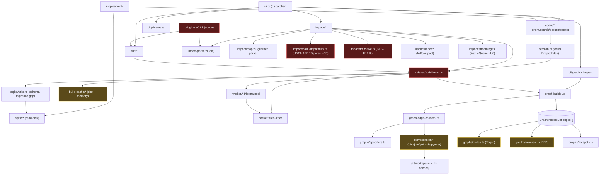

# Codegraph Technical Audit

Deep-dive audit of `@lzehrung/codegraph` (v1.8.87, ~57.5k LOC TypeScript). Findings grouped by the 5 pillars, followed by an issue matrix with remediation snippets and a structural map.

Severity legend: **C** critical · **H** high · **M** medium · **L** low.

---

## 1. Accuracy & Stability

| ID  | File                              | Finding                                                                                                                                                                                                                                                                                                                |
| --- | --------------------------------- | ---------------------------------------------------------------------------------------------------------------------------------------------------------------------------------------------------------------------------------------------------------------------------------------------------------------------- |
| C1  | `src/util/git.ts`                 | **Git argument injection.** `gitDiffArgs` and the `changedSince` path emit user-controlled revisions (`--git-base/--git-head/--changed-since`) as standalone argv tokens before `--`. A value like `--output=/etc/x` or `--upload-pack=...` is parsed as a git flag.                                                   |
| C2  | `src/indexer/build-index.ts`      | **Stale incremental graph.** Incremental rebuild flags only self-changed files; transitive _dependents_ of a modified file reuse cached edges/symbols, yielding stale graph edges and wrong navigation/impact results.                                                                                                 |
| C3  | `src/impact/callCompatibility.ts` | **Unguarded parse aborts analysis.** Three `ensureParsedContext` calls (1331, 1429, 1493) throw on unparseable/deleted files; unlike `map.ts` (which guards every call), one bad file aborts the entire impact run -> zero results.                                                                                    |
| H1  | `src/impact/transitive.ts`        | **Shared-array mutation.** BFS mutates the `reasons` array in place across aliased `ImpactItem` references (159-163); emitted items can gain reasons from later traversal.                                                                                                                                             |
| H2  | `src/impact/transitive.ts`        | **Order-dependent propagation.** `visited.add` (157) locks a node on the first path that reaches it; severity/confidence on the _item_ are merged via `Math.max`, but the node is never re-enqueued, so a shorter/stronger later path cannot re-propagate downstream depth/reasons -> traversal order affects results. |
| H3  | `src/indexer/build-workers.ts`    | **Swallowed teardown failure.** `pool.destroy()` failure caught by empty `catch` -> leaked worker threads reported as success.                                                                                                                                                                                         |
| H4  | `src/cli.ts`                      | **No embedder error boundary.** Exported `runCli` (977) lacks the top-level try/catch the direct-exec path has; dispatcher throws become unhandled rejections for library callers.                                                                                                                                     |
| M1  | `src/util/concurrency.ts`         | `Semaphore.release()` has no over-release guard (corrupts shared global IO semaphore); `acquire()` is non-cancelable (timeout/abort leaks a dead waiter -> off-by-one permit deadlock).                                                                                                                                |
| M2  | `src/util/comments.ts`            | **ReDoS** in `stripPythonCommentsAndStrings` (393-398): backreferenced lazy triple-quote + classic catastrophic string regex backtrack on adversarial unterminated input.                                                                                                                                              |
| M3  | `src/native/bindingLoader.ts`     | Fallback silently loads a stale published addon when the local build fails, discarding the actionable local-build error (`error ?? lastError` prefers the wrong one).                                                                                                                                                  |
| M4  | `src/impact/parse.ts`             | `decodeGitPath` decodes octal escapes via per-escape `fromCharCode`, corrupting multibyte UTF-8 paths; malformed hunk headers drop files/hunks silently.                                                                                                                                                               |
| M5  | `src/languages/sfc.ts`            | Closing-tag scan matches `</script>` inside strings/comments and `break`s, abandoning all remaining SFC blocks on one bad tag.                                                                                                                                                                                         |

---

## 2. Performance

| ID  | File                                      | Finding (Big-O)                                                                                                                                                                                                                    |
| --- | ----------------------------------------- | ---------------------------------------------------------------------------------------------------------------------------------------------------------------------------------------------------------------------------------- |
| P1  | `src/graphs/cycles.ts`                    | Recursive Tarjan `strongconnect` -> **stack overflow** on deep graphs; per-component edge rescan is **O(C·E)** (quadratic on heavily-cyclic graphs).                                                                               |
| P2  | `src/graphs/traversal.ts`                 | Adjacency index rebuilt **per query** in `getDependencies/getReverseDependencies/getShortestPath` -> O(V·E) for multi-query callers. Graph is immutable post-build; memoize via `WeakMap<Graph, Index>`.                           |
| P3  | `src/indexer/navigation.ts`               | `findReferences` receiver-method fallback is **O(F·N·cost(goto))** -- sweeps every file, runs per-node `goToDefinition`.                                                                                                           |
| P4  | `src/indexer/navigation-references.ts`    | `filesExportingDefinition` sweeps the entire index per query (first call uncached). Precompute an inverted def->exporting-files index at finalize.                                                                                 |
| P5  | `src/util/resolution.ts`                  | Unbounded process-global `resolveSpecifierCache` keyed per-`fromFile` -> near-zero hit rate for relative specs + memory growth; path-map probing uses sync `fileExistsSync`, blocking the event loop inside "parallel" resolution. |
| P6  | `src/indexer/build-cache/module-cache.ts` | Process-global `memoryCache` Map is **unbounded, never evicted, not scoped to projectRoot/build** -> leaks full `ModuleIndex` objects in long-lived processes (MCP server, sessions).                                              |
| P7  | `src/util/lazySymbols.ts`                 | `LazyProjectIndex.modules` effectively unbounded: eviction only unloads `locals` arrays, never deletes Map entries; `maxCached < 0` silently disables eviction.                                                                    |
| P8  | `src/util/bloomFilter.ts`                 | `getHashes` derives only 7 distinct offsets from sha256 -> `hashCount` 8-10 silently degrades; size clamped _after_ `k` computed (desync), understating true FPR. `add()` OOB guard `return`s mid-insert (latent false negative).  |
| P9  | `src/duplicates.ts`                       | Per-unit `text` + `normalizedTokens` stored/serialized but never read after construction (~3x memory); `astContextCache` holds all parse trees for the whole run.                                                                  |
| P10 | `src/sqlite/canned-query.ts`              | `bfsFileTraversal` walks the entire reachable graph (no depth/node cap), one query per node; `IN (...)` list can exceed SQLite's ~999-variable limit.                                                                              |

---

## 3. Usability (Humans & Agents)

| ID  | File                                    | Finding                                                                                                                                                                                                                                                                                                       |
| --- | --------------------------------------- | ------------------------------------------------------------------------------------------------------------------------------------------------------------------------------------------------------------------------------------------------------------------------------------------------------------- |
| U1  | `src/agent/explain.ts`                  | **Non-deterministic agent output.** `collectReferenceContext` (734-748) truncates references to `collectionLimit` _before_ sorting -> the displayed subset is index-iteration-order dependent when matches exceed the cap. Same pattern in `agent-tools.ts:449-463`. Agents cannot rely on stable references. |
| U2  | `src/cli/impact.ts`, `src/cli/graph.ts` | Unvalidated enum casts: `--scope`, `--ref-context`, `--symbols-detailed-scope` are `as`-cast without validation; bad values are silently ignored rather than rejected.                                                                                                                                        |
| U3  | `src/cli/context.ts`                    | Long value-options consume the next token even if it is another `--flag` (no leading-dash guard like `-o` has) -> silent wrong values.                                                                                                                                                                        |
| U4  | `src/cli/options.ts`                    | `parseIntegerOptionValue` uses bare `Number()`: `--threads ''` -> 0, `--depth 0x5` -> 5, `1e2` accepted. Pre-validate `/^-?\d+$/`.                                                                                                                                                                            |
| U5  | `src/mcp/http.ts`                       | HTTP MCP transport has **no authentication**; wildcard binds (`0.0.0.0`/`::`) plus external-interface host headers expose an unauthenticated tool surface to the network.                                                                                                                                     |
| U6  | `src/impact/streaming.ts`               | `impactError` is checked only _after_ the drain loop -> partial `impactItem` chunks are emitted before the terminal `error` chunk, contradicting the streaming contract. Also unbounded `createAsyncQueue` = no backpressure.                                                                                 |

---

## 4. Simplicity & Organization

| ID  | File                                                   | Finding                                                                                                                                                           |
| --- | ------------------------------------------------------ | ----------------------------------------------------------------------------------------------------------------------------------------------------------------- |
| S1  | `src/duplicates.ts`                                    | **2770-line god module.** Should split into ~8 modules (types, unit-cache, fingerprint, units, candidates, scoring, clustering, orchestrator).                    |
| S2  | `src/cli.ts`                                           | `runCliWithActiveRuntime` is a ~870-line function with a 25-branch `cmd===` ladder, repeated handler-context boilerplate, and triple-duplicated version handling. |
| S3  | `src/languages/definitions/{javascript,typescript}.ts` | ~200 lines duplicated (blocks/splitPoints/locals/importBindings/classify/scope, `isTypeOnly` x3). `cFamily.ts` already proves the correct shared-factory pattern. |
| S4  | `src/impact/{reportFull,reportCompact}.ts`             | `buildFullCycles`/`buildCompactCycles` duplicate cycle file/edge mapping -- extract a generic `mapCycles` into `reportShared.ts`.                                 |
| S5  | `src/cli.ts`, `inspect.ts`, `orient.ts`                | Include-root filtering logic duplicated across three files; extract one util.                                                                                     |
| S6  | `src/impact/callCompatibility.ts`                      | `attachCallCompatibilityHints` is a ~172-line function with 6+ nesting levels.                                                                                    |

---

## 5. Usefulness (Dead / Redundant Code)

| ID  | File                          | Finding                                                                                                                  |
| --- | ----------------------------- | ------------------------------------------------------------------------------------------------------------------------ |
| D1  | `src/util/bloomFilter.ts`     | `toBuffer`/`fromBuffer` omit `size`/`hashCount` and are dead/unsafe -- filters are rebuilt per-process, never persisted. |
| D2  | `src/duplicates.ts`           | Per-unit `text`/`normalizedTokens` fields are written and serialized but never read post-construction (see P9).          |
| D3  | `src/native/projectedTree.ts` | Empty-source clamp makes the `??` fallback (line 36) dead code.                                                          |
| D4  | `src/util/partialResults.ts`  | Dead `indexOf` in the rejected branch.                                                                                   |

---

## Issue Matrix -- Critical & High (root cause -> impact -> fix)

### C1 -- Git argument injection (`src/util/git.ts`)

**Root cause:** revisions pushed as standalone argv with no leading-dash guard.
**Systemic impact:** crafted `--base`/`--head`/`--changed-since` becomes a git flag (arbitrary file write via `--output=`, RCE-adjacent via `--upload-pack=`) in `impact`/`review`/`drift`.

```ts
function assertSafeRevision(value: string, label: string): string {
  if (value.startsWith("-")) {
    throw new Error(`Invalid ${label} "${value}": revisions must not start with "-".`);
  }
  return value;
}

export function gitDiffArgs(base: string, head: string, extraArgs: string[] = []): string[] {
  assertSafeRevision(base, "base");
  if (isGitWorktreeSentinel(head)) return ["diff", "--end-of-options", ...extraArgs, base];
  if (isGitIndexSentinel(head)) return ["diff", "--cached", "--end-of-options", ...extraArgs, base];
  assertSafeRevision(head, "head");
  return ["diff", "--end-of-options", ...extraArgs, `${base}..${head}`];
}
```

Apply `assertSafeRevision` to `changedSince` in `listChangedFiles`/`getUnifiedDiff` too.

### C2 -- Stale incremental graph (`src/indexer/build-index.ts` + `incremental-plan.ts`)

**Root cause:** `changedFiles` = self-changed only; dependents of _modified_ files are not invalidated (`collectDeletedTrackedFileDependents` covers only deleted targets).
**Systemic impact:** after editing an exported symbol, dependents keep stale edges -> wrong go-to-def/refs/impact until full rebuild.
**Fix:** compute a reverse-dependency closure over all changed (not just deleted) files and add them to the rebuild set.

```ts
function expandWithDependents(reverseDeps: Map<FileId, FileId[]>, changed: Set<FileId>): Set<FileId> {
  const out = new Set(changed);
  const queue = [...changed];
  while (queue.length) {
    const file = queue.shift()!;
    for (const dependent of reverseDeps.get(file) ?? []) {
      if (!out.has(dependent)) {
        out.add(dependent);
        queue.push(dependent);
      }
    }
  }
  return out;
}
```

### C3 -- Unguarded parse aborts impact (`src/impact/callCompatibility.ts`)

**Root cause:** `ensureParsedContext` thrown errors not caught (1331/1429/1493).
**Systemic impact:** one deleted/unparseable file zeroes the whole impact report.
**Fix:** mirror `map.ts`'s guard.

```ts
let parsed: ParsedContext | null = null;
try {
  parsed = await ensureParsedContext(file, index.parsed?.get(file));
} catch {
  incrementSkippedReason(diagnostics, "parse-failed");
  continue; // skip this symbol/callsite, keep the run alive
}
```

### H1/H2 -- Transitive BFS mutation + order dependence (`src/impact/transitive.ts`)

**Root cause:** in-place `reasons.push` on aliased items; first-enqueued-wins severity.
**Systemic impact:** non-deterministic severity/reasons -> unstable agent + CI output.
**Fix:** copy-on-write reasons and upgrade on stronger path.

```ts
const existing = impacted.get(dep);
const nextReason = { kind, depth, from: file };
if (existing) {
  const severity = calculateTransitiveSeverity(depth);
  if (severityRank(severity) > severityRank(existing.severity)) {
    existing.severity = severity;
    existing.reasons = [...existing.reasons, nextReason]; // new array, no aliasing
  }
} else {
  impacted.set(dep, { /* ... */ reasons: [nextReason] });
  queue.push({ file: dep, depth, reason: nextReason });
}
```

### H3 -- Swallowed worker teardown (`src/indexer/build-workers.ts`)

```ts
try {
  await setup.pool.destroy();
} catch (error) {
  if (setup.report) setup.report.teardownError = stringifyUnknown(error);
} finally {
  setup.pool = null;
}
```

### H4 -- Embedder error boundary (`src/cli.ts`)

```ts
export async function runCli(argv: string[] = process.argv.slice(2)): Promise<void> {
  try {
    await runWithCliRuntime(() => runCliWithActiveRuntime(argv));
  } catch (error) {
    writeError(error);
    exitCli(1);
  }
}
```

### U1 -- Sort-before-truncate (`src/agent/explain.ts`)

**Fix:** sort the full result set, _then_ bound.

```ts
const references = result.references
  .map((r) => ({ file: normalizeAgentFilePath(snapshot.root, r.file), range: r.range }))
  .sort((a, b) => a.file.localeCompare(b.file) || a.range.start.line - b.range.start.line);
const boundedReferences = boundAgentList(references, referenceLimit); // bound AFTER sort
```

(Raise the `findReferences` `maxReferences` cap above the display limit so the cap itself isn't order-dependent.)

### P6/P7/P5 -- Unbounded memory caches (`module-cache.ts`, `lazySymbols.ts`, `resolution.ts`)

**Fix:** LRU with a cap, keyed by `projectRoot::file`, cleared on teardown.

```ts
const MAX_MEMORY_CACHE = 5000;
function setMemoryCache(key: string, entry: ModuleCacheEntry): void {
  if (memoryCache.size >= MAX_MEMORY_CACHE) {
    const oldest = memoryCache.keys().next().value; // Map preserves insertion order
    if (oldest !== undefined) memoryCache.delete(oldest);
  }
  memoryCache.set(key, entry);
}
export function clearMemoryCache(): void {
  memoryCache.clear();
}
```

### SQLite schema migration gap (`src/sqlite/schema.ts`)

**Root cause:** `SQLITE_SCHEMA_VERSION = 2` but only the `visibility` column has an `ALTER`; new tables/indexes rely on `CREATE ... IF NOT EXISTS` and the version is stamped unconditionally with nothing reading it. Violates `AGENTS.md:26`.
**Fix:** read on-disk `graph_metadata.schema_version`, run an explicit migrator for each version step, stamp the new version only after success, and add a v1->v2 upgrade regression test.

---

## Structural Map



---

## Remediation Priority

Ordered checklist. Each item should land with a regression test in the same change.

- [x] **1. C1 git injection** (`util/git.ts`) -- `assertSafeRevision` + `--end-of-options`; test crafted `--output=`/`--upload-pack=` revisions are rejected.
- [x] **2. C3 unguarded parse** (`impact/callCompatibility.ts`) -- wrap the three `ensureParsedContext` calls in try/catch + `incrementSkippedReason`; test a deleted/unparseable file no longer zeroes the report.
- [x] **3. H1/H2 transitive BFS** (`impact/transitive.ts`) -- copy-on-write `reasons`, upgrade severity/reasons on a stronger path; test order-independence.
- [x] **4. C2 stale incremental graph** (`indexer/build-index.ts`, `incremental-plan.ts`) -- reverse-dependency closure over all changed files; test dependents re-resolve after an export change.
- [x] **5. P6/P7/P5 unbounded caches** (`module-cache.ts`, `lazySymbols.ts`, `resolution.ts`) -- LRU + cap + teardown clear; test eviction.
- [x] **6. SQLite schema migration** (`sqlite/schema.ts`) -- versioned migrator keyed off on-disk version; v1->v2 upgrade regression test (`AGENTS.md:26`).
- [x] **7. U1 sort-before-truncate / U2-U4 CLI validation** -- sort before bound; reject bad enum/int flags.
- [x] **8. P1/P2 cycles + adjacency** (`graphs/cycles.ts`, `traversal.ts`) -- iterative Tarjan, memoized adjacency.
- [x] **9. S3-S6 structural (S1/S2 deferred)** -- dedupe JS/TS shared blocks, cycle mappers, include-root util, callCompatibility hint/reset helpers; full `duplicates.ts`/`cli.ts` splits deferred.
