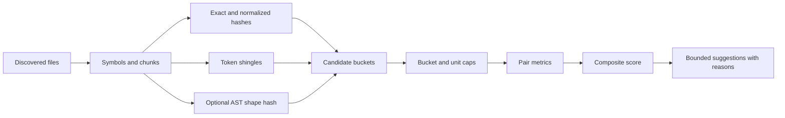

# Duplicate Detection Design

## Recommendation

Use a structural-first duplicate detector.

- V1 core: exact region hashes, normalized text hashes, token shingles, winnowed signatures, and symbol/chunk metadata.
- V1 optional: normalized AST shape hashes when parse trees are already available.
- Not V1 core: model embeddings, semantic-equivalence claims, or SQLite schema changes.
- External workflow: keep embeddings outside Codegraph through `codegraph chunk` output.

This matches Codegraph's deterministic search and review model:

- [Agent search plan](./2026-05-14-agent-search-artifact-mcp.md) keeps search/explain vectorless and deterministic.
- [Agent workflows](../../agent-workflows.md) documents bounded search/explain packets.
- [Library API](../../library-api.md) documents chunking for LLM and vector workflows.
- [How it works](../../how-it-works.md) documents Tree-sitter, `ProjectIndex`, and content-hash caching.

## Problem

Duplicate detection should surface likely refactor candidates, not prove semantic equivalence.

In scope:

- Find exact, renamed, and near-copy regions for human or agent review.
- Rank candidates by transparent reasons.
- Bound runtime on large repositories.
- Reuse discovery, chunking, symbol, graph, and impact infrastructure.

Out of scope:

- Type-4 semantic equivalence proof.
- Cross-language clone detection in V1.
- Embedding storage or model execution in core.
- Persistent SQLite schema changes for the first implementation.

## Source Anchors

- [`src/chunking/chunkFile.ts`](../../../src/chunking/chunkFile.ts): semantic chunk boundaries.
- [`src/chunking/chunkSFC.ts`](../../../src/chunking/chunkSFC.ts): single-file component block chunking.
- [`src/indexer/types.ts`](../../../src/indexer/types.ts): `ProjectIndex`, `ModuleIndex`, and `SymbolDef` metadata.
- [`src/agent/search.ts`](../../../src/agent/search.ts): deterministic scores, reasons, limits, and stable sort behavior.
- [`src/graphs/grep.ts`](../../../src/graphs/grep.ts): AST and text grep capabilities.
- [`src/impact/parse.ts`](../../../src/impact/parse.ts): git rename/copy `similarityIndex` parsing.
- [`src/impact/types.ts`](../../../src/impact/types.ts): impact file-change metadata.

## Taxonomy

| Clone type | Description | V1 support | Primary signals |
| --- | --- | --- | --- |
| Type-1 | Exact duplicated text | Yes | Raw or normalized text hash |
| Type-2 | Same structure with renamed identifiers or literals | Yes | AST shape hash, token shingles |
| Type-3 | Edited copy with inserted or deleted statements | Partial | Winnowing, Jaccard, ordered-token similarity |
| Type-4 | Semantically equivalent but structurally different | External only | Embeddings or deeper semantic analysis |

Type-4 results are discovery hints when powered externally.

## Approach Catalog

### 1. Exact Region Hash

- Inputs: source text and unit range.
- Hooks: `ProjectIndex` symbols, semantic chunks, content-hash cache behavior.
- Cost: O(bytes).
- Strength: strongest Type-1 signal.
- Weakness: misses renames and small edits.

### 2. Comment and Whitespace Normalized Hash

- Inputs: source text, language comment rules where available.
- Hooks: language definitions and parser-backed comments.
- Cost: O(bytes).
- Strength: catches formatting drift.
- Weakness: string-literal-safe comment stripping needs care.

### 3. Symbol Metadata Prefilter

- Inputs: `SymbolDef.kind`, `range`, `lineSpan`, `complexity`, docstring, export status.
- Hooks: `src/indexer/types.ts` and locals/export extraction.
- Cost: O(symbols).
- Strength: reduces candidate comparisons.
- Weakness: metadata is never proof by itself.

### 4. Chunk-Body Similarity

- Inputs: `Chunk` records from code, text, and SFC chunkers.
- Hooks: `chunkFile`, `chunkTextFile`, and `chunkSFCFile`.
- Cost: O(chunks + candidate pairs).
- Strength: works when symbol extraction is incomplete.
- Weakness: broad chunks can create boilerplate matches.

### 5. Token N-Gram Fingerprints

- Inputs: normalized tokens from each unit.
- Hooks: symbol ranges and chunk boundaries.
- Cost: O(tokens), plus memory for unique shingles.
- Strength: Type-2 and lightweight Type-3 candidate generation.
- Weakness: common boilerplate buckets need caps.

### 6. Winnowing or MinHash

- Inputs: token shingles.
- Hooks: internal duplicate fingerprint index.
- Cost: O(tokens) indexing plus candidate verification.
- Strength: scalable near-copy detection.
- Weakness: requires shingle, window, and threshold tuning.

### 7. Normalized AST Fingerprint

- Inputs: Tree-sitter parse tree and unit range.
- Hooks: native parser and JS fallback parser paths.
- Cost: parser-dependent and deterministic.
- Strength: strong Type-2 signal.
- Weakness: parity requires explicit language rules.

### 8. AST Structural Grep Recurrence

- Inputs: Tree-sitter queries or text patterns.
- Hooks: `src/graphs/grep.ts`.
- Cost: O(files) per query.
- Strength: targeted repeated anti-patterns.
- Weakness: not a general clone detector.

### 9. Git Similarity Metadata

- Inputs: git or raw diff metadata.
- Hooks: `similarityIndex` from impact parsing.
- Cost: free when impact already parses git diff.
- Strength: PR-scoped copy and rename context.
- Weakness: not whole-repo detection.

### 10. External Embeddings

- Inputs: `codegraph chunk` text and metadata.
- Hooks: chunk CLI and library APIs.
- Cost: external runtime and storage.
- Strength: Type-4 discovery and natural-language similarity.
- Weakness: not deterministic core proof.

## Pipeline



## Unit Collection

Default strategy:

- Prefer symbols for functions, methods, classes, interfaces, types, SQL routines, and SQL objects.
- Fall back to semantic chunks when symbol coverage is incomplete.
- Preserve both symbol and chunk identity where both exist.
- Skip units below `minTokens`, default `40`, unless exact small matches are requested.
- Skip or split units above `maxTokens`, default `800`.

Suggested shape:

```ts
type DuplicateUnit = {
  id: string;
  file: string;
  languageId: string;
  kind: "symbol" | "chunk" | "sql" | "text";
  name?: string;
  symbolKind?: string;
  startLine: number;
  endLine: number;
  tokenCount: number;
  complexity?: number;
};
```

## Fingerprints

Generate cheap signals first:

- `rawHash`: exact source region hash.
- `normalizedTextHash`: comment and whitespace normalized hash.
- `tokenShingles`: normalized token k-grams, default `k = 5`.
- `winnowedSignature`: representative shingle hashes, default window size `4`.
- `astShapeHash`: optional normalized AST structure hash.

## Candidate Generation

Avoid all-pairs comparison.

- Bucket by normalized text hash, AST shape hash, and winnowed shingle hashes.
- Cap buckets larger than `maxBucketSize`, default `200`.
- Compare pairs with exact hash, AST hash, enough shared shingles, or PR git similarity.
- Preserve pair identity as sorted `(leftUnitId, rightUnitId)`.

## Pair Metrics

For each candidate pair, compute bounded metrics:

- `tokenJaccard`
- `orderedTokenSimilarity`
- `shingleOverlap`
- `lengthRatio`
- `sameSymbolKind`
- `lineSpanRatio`
- `astShapeEqual`
- `sameFile`
- `sharedDependencyContext`

## Output Shape

```ts
type DuplicateSuggestion = {
  score: number;
  confidence: "high" | "medium" | "low";
  cloneType: "exact" | "renamed" | "near" | "weak";
  left: DuplicateUnitRef;
  right: DuplicateUnitRef;
  metrics: DuplicateMetrics;
  reasons: string[];
};
```

## Scoring

Scores are deterministic and capped to `0..100`.

Positive signals:

| Signal | Weight | Reason |
| --- | ---: | --- |
| Raw source hash match | +60 | `raw_hash_match` |
| Normalized text hash match | +50 | `normalized_text_hash_match` |
| AST shape hash match | +40 | `ast_shape_match` |
| Token Jaccard >= 0.95 | +30 | `token_jaccard_0.97` |
| Token Jaccard >= 0.85 | +22 | `token_jaccard_0.88` |
| Token Jaccard >= 0.70 | +12 | `token_jaccard_0.73` |
| Shingle overlap | +0..25 | `shared_shingles_14` |
| Ordered token similarity >= 0.80 | +10 | `ordered_similarity_0.84` |
| Same symbol kind | +4 | `same_symbol_kind_function` |
| Similar line span | +4 | `similar_line_span` |
| Similar complexity | +3 | `similar_complexity` |
| PR git similarity >= 80% | +20 | `git_similarity_92` |
| Shared dependency context | +3 | `shared_dependency_context` |

Negative signals:

| Signal | Weight | Reason |
| --- | ---: | --- |
| Token count below threshold | -25 | `trivial_body_penalty` |
| Length ratio outside `0.5..2.0` | -20 | `length_mismatch_penalty` |
| Boilerplate bucket too large | -20 | `boilerplate_bucket_penalty` |
| License/header-only region | -30 | `license_header_penalty` |
| Generated or vendored path | -15 | `generated_path_penalty` |
| Same file and adjacent regions | -10 | `same_file_adjacent_penalty` |

Hard filters:

- Ignore files excluded by discovery config or CLI ignore globs.
- Discard overlapping ranges in the same file.
- Discard same enclosing-symbol containment.
- Discard below-threshold units unless exact small matching is enabled.
- Discard oversized buckets without exact or AST evidence.

Confidence tiers:

- High: `score >= 80`, exact hash with `tokenJaccard >= 0.90`, or AST match with `tokenJaccard >= 0.85`.
- Medium: `score >= 55` and `tokenJaccard >= 0.70`.
- Low: `score >= 35`.

Clone types:

- `exact`: raw or normalized text hash match.
- `renamed`: AST shape match or very high token similarity with renamed identifiers/literals.
- `near`: strong shingle or token similarity with edits.
- `weak`: low-threshold structural similarity.

Sort order:

1. Confidence rank.
2. Score descending.
3. Token Jaccard descending.
4. Left file, left line, right file, right line.

## Rollout

### Phase 0: Design Doc

- Add this plan.
- Do not update public capability docs until implementation ships.

### Phase 1: In-Memory Engine

- Add unit extraction and fingerprinting helpers.
- Implement exact hashes, normalized text hashes, shingles, and winnowing.
- Add focused fixtures.
- Avoid cache or SQLite persistence.

### Phase 2: CLI and Library

- Add `findDuplicates(index, options)`.
- Add `codegraph duplicates`.
- Return deterministic JSON with bounded results and omission counts.
- Update CLI, library API, and skill docs.

### Phase 3: AST Normalization

- Add language-aware AST shape hashing.
- Update language parity and scenario docs.
- Add per-language tests.

### Phase 4: PR and Agent Integration

- Use git `similarityIndex` in review or impact mode.
- Add duplicate candidates to explain packets only after output stabilizes.

### Phase 5: Optional Persistence

- Consider duplicate cache files only if repeated runs need them.
- Add SQLite schema migrations only with a clear query use case.

## Parity Rules

- V1 compares same-language units only.
- Source languages use symbol-first units where possible.
- SQL can start with statement/object chunks.
- Vue, Svelte, and Astro compare script/style/template blocks separately.
- Graph-first formats and config files may be chunk-only.
- Document language limitations when AST normalization arrives.

## Testing

Core cases:

- Exact duplicate functions in two files.
- Renamed variables and literals.
- Near-copy with one edited branch.
- Same-file non-overlapping duplicates.
- Similar names with different bodies.
- Tiny trivial helpers below threshold.
- Generated or header boilerplate.
- Deterministic result ordering.
- Large repeated boilerplate buckets.
- PR `similarityIndex` boosts changed-file suggestions.

## Open Questions

- Should `minTokens` default to `40`, or stay closer to the `150` chunking default?
- Should same-file duplicates be enabled by default?
- Should hotspot files increase score or decrease score?
- Should PR mode compare changed regions against the whole repo or dependency neighborhoods?
- Should embeddings remain external, or should a plugin interface accept external similarity scores?
