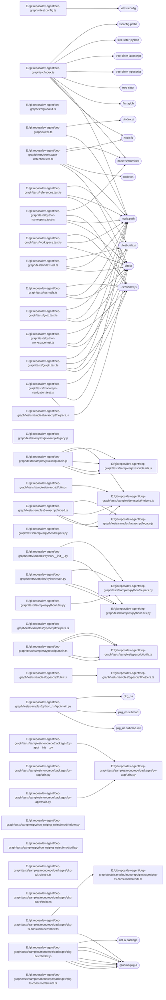

```mermaid
flowchart LR
n0["E:/git repos/dev-agent/dep-graph/vitest.config.ts"]
n1["E:/git repos/dev-agent/dep-graph/src/cli.ts"]
n2["E:/git repos/dev-agent/dep-graph/src/global.d.ts"]
n3["E:/git repos/dev-agent/dep-graph/src/index.ts"]
n4["E:/git repos/dev-agent/dep-graph/tests/goto.test.ts"]
n5["E:/git repos/dev-agent/dep-graph/tests/graph.test.ts"]
n6["E:/git repos/dev-agent/dep-graph/tests/index.test.ts"]
n7["E:/git repos/dev-agent/dep-graph/tests/monorepo-navigation.test.ts"]
n8["E:/git repos/dev-agent/dep-graph/tests/python-namespace.test.ts"]
n9["E:/git repos/dev-agent/dep-graph/tests/python-workspace.test.ts"]
n10["E:/git repos/dev-agent/dep-graph/tests/references.test.ts"]
n11["E:/git repos/dev-agent/dep-graph/tests/test-utils.ts"]
n12["E:/git repos/dev-agent/dep-graph/tests/workspace-detection.test.ts"]
n13["E:/git repos/dev-agent/dep-graph/tests/workspace.test.ts"]
n14["E:/git repos/dev-agent/dep-graph/tests/samples/javascript/helpers.js"]
n15["E:/git repos/dev-agent/dep-graph/tests/samples/javascript/legacy.js"]
n16["E:/git repos/dev-agent/dep-graph/tests/samples/javascript/main.js"]
n17["E:/git repos/dev-agent/dep-graph/tests/samples/javascript/mixed.js"]
n18["E:/git repos/dev-agent/dep-graph/tests/samples/javascript/utils.js"]
n19["E:/git repos/dev-agent/dep-graph/tests/samples/python/helpers.py"]
n20["E:/git repos/dev-agent/dep-graph/tests/samples/python/main.py"]
n21["E:/git repos/dev-agent/dep-graph/tests/samples/python/utils.py"]
n22["E:/git repos/dev-agent/dep-graph/tests/samples/python/__init__.py"]
n23["E:/git repos/dev-agent/dep-graph/tests/samples/typescript/helpers.ts"]
n24["E:/git repos/dev-agent/dep-graph/tests/samples/typescript/main.ts"]
n25["E:/git repos/dev-agent/dep-graph/tests/samples/typescript/utils.ts"]
n26["E:/git repos/dev-agent/dep-graph/tests/samples/python_ns/app/main.py"]
n27["E:/git repos/dev-agent/dep-graph/tests/samples/monorepo/packages/py-app/main.py"]
n28["E:/git repos/dev-agent/dep-graph/tests/samples/monorepo/packages/py-app/utils.py"]
n29["E:/git repos/dev-agent/dep-graph/tests/samples/monorepo/packages/py-app/__init__.py"]
n30["E:/git repos/dev-agent/dep-graph/tests/samples/python_ns/pkg_ns/submod/helper.py"]
n31["E:/git repos/dev-agent/dep-graph/tests/samples/python_ns/pkg_ns/submod/util.py"]
n32["E:/git repos/dev-agent/dep-graph/tests/samples/monorepo/packages/pkg-a/src/extra.ts"]
n33["E:/git repos/dev-agent/dep-graph/tests/samples/monorepo/packages/pkg-a/src/index.ts"]
n34["E:/git repos/dev-agent/dep-graph/tests/samples/monorepo/packages/pkg-b/src/index.js"]
n35["E:/git repos/dev-agent/dep-graph/tests/samples/monorepo/packages/pkg-ts-consumer/src/index.ts"]
n36["E:/git repos/dev-agent/dep-graph/tests/samples/monorepo/packages/pkg-ts-consumer/src/util.ts"]
n37(["vitest/config"])
n38(["node:path"])
n39(["./index.js"])
n40(["node:fs"])
n41(["node:fs/promises"])
n42(["fast-glob"])
n43(["tree-sitter"])
n44(["tree-sitter-typescript"])
n45(["tree-sitter-javascript"])
n46(["tree-sitter-python"])
n47(["tsconfig-paths"])
n48(["vitest"])
n49(["./test-utils.js"])
n50(["../src/index.js"])
n51(["node:os"])
n52["E:/git repos/dev-agent/dep-graph/tests/samples/javascript/utils.js"]
n53["E:/git repos/dev-agent/dep-graph/tests/samples/javascript/helpers.js"]
n54["E:/git repos/dev-agent/dep-graph/tests/samples/javascript/legacy.js"]
n55["E:/git repos/dev-agent/dep-graph/tests/samples/python/utils.py"]
n56["E:/git repos/dev-agent/dep-graph/tests/samples/python/helpers.py"]
n57["E:/git repos/dev-agent/dep-graph/tests/samples/typescript/utils.ts"]
n58["E:/git repos/dev-agent/dep-graph/tests/samples/typescript/helpers.ts"]
n59(["pkg_ns.submod.util"])
n60(["pkg_ns.submod"])
n61(["pkg_ns"])
n62["E:/git repos/dev-agent/dep-graph/tests/samples/monorepo/packages/py-app/utils.py"]
n63(["@acme/pkg-a"])
n64(["not-a-package"])
n65["E:/git repos/dev-agent/dep-graph/tests/samples/monorepo/packages/pkg-ts-consumer/src/util.ts"]
n0 --> n37
n1 --> n38
n1 --> n39
n3 --> n40
n3 --> n41
n3 --> n38
n3 --> n42
n3 --> n43
n3 --> n44
n3 --> n45
n3 --> n46
n3 --> n47
n4 --> n48
n4 --> n38
n4 --> n49
n5 --> n48
n5 --> n38
n5 --> n50
n5 --> n49
n6 --> n48
n6 --> n38
n6 --> n49
n7 --> n48
n7 --> n38
n7 --> n50
n8 --> n48
n8 --> n38
n8 --> n50
n8 --> n41
n9 --> n48
n9 --> n38
n9 --> n50
n10 --> n48
n10 --> n38
n10 --> n49
n11 --> n48
n11 --> n38
n11 --> n50
n12 --> n48
n12 --> n38
n12 --> n51
n12 --> n40
n12 --> n41
n13 --> n48
n13 --> n38
n13 --> n50
n16 --> n52
n16 --> n52
n16 --> n52
n16 --> n52
n16 --> n53
n17 --> n53
n17 --> n54
n17 --> n53
n17 --> n54
n18 --> n53
n20 --> n55
n20 --> n55
n20 --> n56
n21 --> n56
n22 --> n55
n22 --> n56
n24 --> n57
n24 --> n57
n24 --> n57
n24 --> n57
n25 --> n58
n26 --> n59
n26 --> n60
n26 --> n61
n27 --> n62
n29 --> n62
n34 --> n63
n34 --> n63
n34 --> n63
n34 --> n63
n34 --> n63
n34 --> n63
n34 --> n64
n35 --> n63
n35 --> n65
```